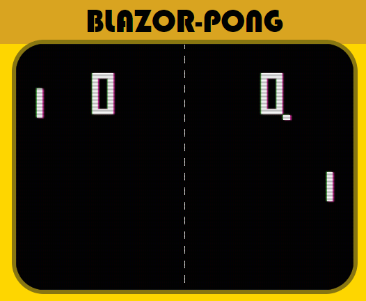

# A Blazor Pong

### Live Demo: http://blazorpong.surge.sh

A Blazor Pong was an personal experiment to remake the classical pong for browser without any
javascript.

### The challenge:

- No JavaScript could be used. Neither JsInterop invokes. Zero JS, nada!
- Should have sounds effects. Sounds should be handled without JS.
- Should look like the original pong.
- Has to look nice an playable, despite not be using canvas and js libs.
- The code should be the simple and claen. Easy for anyone to understand and replicate.